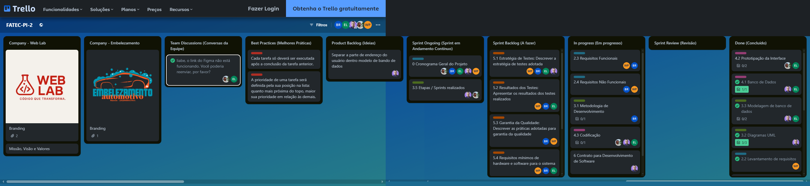

<h1 align="center"> Projeto Interdisciplinar 2025 | DSM</h1>
<p align="center">

  
  
</p>

<p align="center">
Projeto Interdisciplinar 2° semestre, do curso <a href="https://fatecararas.cps.sp.gov.br/tecnologia-em-desenvolvimento-de-softwares-multiplataforma/">DSM- Desenvolvimento de software multiplataforma.</a>

Software liberado para uso **Não Comercial**, veja sobre a Licença, para mais informações no link:

[](https://creativecommons.org/licenses/by-nc/4.0/)

<p align="center">
  <!--  -->
</p>
<br>

<!-- Licença Creative Commons 4.0 não comercial, para mais informações acesse o link:

[](https://creativecommons.org/licenses/by-nc/4.0/) -->

<h3 align="center">✅ Concluído ✅</h3>
<!-- <h3 align="center">🚧🚧 Em construção! 🏗 👷 🧱🚧</h3> -->

<p align="center">
 <a href="#-tecnologias">Tecnologias</a> • 
 <a href="#-layout-do-projeto">Layout</a> • 
 <a href="#-metodologia-ágil">Metodologia ágil</a> •
 <a href="#-documentação">Documentação</a> •
 <a href="#-sobre-o-projeto">Sobre o Projeto</a> •
 <a href="#-Api ">Api</a> •
 <!-- <a href="#-Deploy">Deploy</a> • -->
 <!-- <a href="#-Live">Live</a> • -->
  <a href="#-autores">Autores</a> •
 <a href="#memo-licença">Licença</a>
 
</p>

 ## 🚀 Tecnologias


Esse projeto foi desenvolvido com as seguintes tecnologias:

<p align="center">
  
  
  
    
  
  

</p>

 ## 💻 Layout do Projeto

<!--  -->

Veja o layout completo  [aqui.](https://www.figma.com/design/PpyOYg0jN5SyXKjDlWTspq/Fatec-Projeto-Integrador-2%C2%BA-S?node-id=0-1&p=f)

<p> Páginas principais apenas:</p>


 ## 🛠 Metodologia ágil

Para o gerenciamento, do projeto, foi utilizado o [Trello](https://trello.com/b/0UhYo6ZL/fatec-pi-2), vizualize os quadros no link anterior;  O Trello é uma ferramenta para melhor controle e divisão de tarefas entre os autores, ficando da seguinte forma igual da imagem abaixo:



## 📚 Documentação

Acesse a documentação do projeto [aqui.](https://github.com/Lucas-Ed/Pi-2-semestre/tree/main/Documenta%C3%A7%C3%A3o)
<!-- ## 🤝🏼 Acessibilidade

 -->

<!-- Apresentação do projeto interdiciplinar,
Confira [aqui.](https://lucas-ed.github.io/grupo-02_pi/#1)


## 📲 Deploy

Acesse o site do Pi [aqui.]()

# 👓 Live

<p>Assista a Live de Apresentação do projeto !</p>
<p>No video abaixo, veja a apresentação do grupo 02.</p>

[](https://www.youtube.com/watch?v=jeLNnmUUFrM) -->

## 💻 Sobre o Projeto

Para rodar o sistema localmente, siga os passos abaixo:

0. Requisito, ter o composer instalado na máquina, caso não tenha baixe [aqui.](https://getcomposer.org/download/)
1. Clone o repositório.
2. Ligue o servidor/Mysql local (XAMPP ou WAMP).
3. Coloque a pasta sistema, na pasta "htdocs" do XAMPP ou WAMP.
4. Dentro da pasta sistema, pelo terminal, instale as dependências com o comando:

```bash
composer install
```

5. Importe o backup do banco de dados "lava_rapido.sql" que esta na pasta `modelagem de banco` no phpmyadmin.
6. Edite o arquivo `.env` com os suas credenciais smtp e senha de app do gmail, para o envio de e-mail para recuperação de senha do usuario.

**OBS:** caso fique na dúvida de como preencher os dados do SMTP no arquivo .env, veja o seguinte [tutorial.](https://www.tabnews.com.br/LucasEd/como-enviar-e-mails-usando-phpmailer-e-gmail-no-xampp-ambiente-de-desenvolvimento-e-producao)

7. No arquivo .env, em `CHAVE_CPF=sua-chave-privada`, você deve adicionar a sua chave privada própria, você pode gerar a chave com o seguinte comando no terminal: 

```bash
openssl rand -base64 16
```

**OBS:**  A chave privada é utilizada para criptografar o CPF do usuário, garantindo a segurança dos dados pessoais, e em conformidade com a **LGPD-(Lei geral de proteção de dados)**.

8. Execute o script `setar_admin.php`, que esta na pasta raiz do sistema, para criar o usuário admin no banco de dados, com o seguinte comando no terminal:

```bash
php setar_admin.php
```
9. Acesse o sistema pelo navegador, no endereço: `http://localhost/sistema/views`.
10. Pronto você verá a página Home do sistema.
11. Faça o login com o usuário admin, que foi criado no passo 8 com as seguintes credenciais de acesso **e-mail:** `admin@admin.com`  **e senha:** `admin123`, ou crie um novo usuário cliente fazendo o cadastro.

## 🧩 Api

O sistema utiliza uma Api interna, que foi desenvolvida para buscar os clientes no banco de dados, e também para listar os agendamentos e veículos do usuário logado, entre outras, veja abaixo as rotas disponíveis:
```bash
GET /api/buscar_clientes.php - Buscar clientes no banco de dados. 
GET /api/get_agendamentos.php - Listar agendamentos do usuário logado.
GET /api/get_veiculos.php - Listar veículos do usuário logado.
GET /api/verifica_perfil.php - Verifica dados do perfil do usuário logado.
```
 
Você pode acessar as rotas da API, através do navegador ou de uma ferramenta como o Postman,
é necessário estar logado como cliente ou admin para testar as funcionalidades, veja as rotas abaixo:

```bash
http://localhost/sistema/controllers/api/buscar_clientes.php

http://localhost/sistema/controllers/api/get_agendamentos.php

http://localhost/sistema/controllers/api/get_veiculos.php

http://localhost/sistema/controllers/api/verifica_perfil.php

```


## 📂 Arquitetura(MVC) e funcionalidades do Projeto

```bash
📂 lava_rapido/
│
├── 📂 config/ 
│   └── 📄 gateway.php-(configuração da API de pagamento/Feature)
│
├── 📂 controllers/-(lógica de negócios - salvar, listar, excluir)
│   ├── 📂 Api/
│   │    ├── 📄 buscar_clientes.php-(buscar usuarios no DB.)
│   │    ├── 📄 get_agendamentos.php-(listar agendamentos)
│   │    ├── 📄 get_veiculos.php-(listar veiculos)
│   │    └── 📄 verifica_perfil.php-(Verifica dados do perfil do usuário)
|   |
|   ├── 📄 add_agendamento.php-(adicionar agendamento)
|   ├── 📄 admin_delete_agendamento.php-(fc. cancelar agendamento do admin)
|   ├── 📄 atualiza_perfil.php-(update de dados do perfil do usuario)
|   ├── 📄 logout.php-(lógica do logout do sistema)
|   ├── 📄 new_pass.php-(lógica de alterarv a senha do usuario)
│   ├── 📄 processa.php-(lógica do cadastro)
|   ├── 📄 removecar.php-(remover veiculo)
|   ├── 📄 remover_agendamento.php-(remover agendamento)
│   ├── 📄 salvar_veiculo.php-(cadastrar veiculo no banco)
|   ├── 📄 send_token.php-(script que envia token de recuperação de senha do usuario)
│   └── 📄 update_status.php-(script que atualiza status de agendamentos)
|
|
├── 📂 model/
│   └── 📄 db.php-(configuração do banco)
│
├── 📂 public/
|   └── 📂 css/-(estilos personalizados)
|   |
│   └── 📂 js/
│   |     ├── 📄 buscar_clientes.js-(busca clientes pela api)
│   |     ├── 📄 cadastro_veiculo.php-(lógica de cadastrar veículo)
│   |     ├── 📄 new_pass__alerts.js-(alerts de recuperação de senha)
│   |     ├── 📄 preencher_cep_perfil.js-(preenche os campos de endereço do modal perfil com base no CEP)
│   |     ├── 📄 recuperacao_alerts.js-(alerts de envio de e-mail com token)
|   |     ├── 📄 val_cads.js-(validações do form de cadastro)
|   |     ├── 📄 val_perfil.js-(validações do modal perfil do usuário)
│   |     └── 📄 welcome.js-(funcionalidades de area  do usuário)
|   |
│   └── 📂 uploads/ (imagens e outros)
|
├── 📂 vendor/-(Blibliiotecas que o sistema depende)
|
├── 📂 views/
|   |
|   |
|   ├── 📄 admin_agendamentos_semanal.php-(Àrea logada Admin)
│   ├── 📄 admin_agendamentos.php-(Àrea logada Admin)
│   ├── 📄 admin_usuarios.php-(Àrea logada Admin)
│   ├── 📄 alter_pass.php-(Página de alterar a senha)
│   ├── 📄 cadastro.php-(Página de cadastro de clientes)
│   ├── 📄 dashboard_admin.php-(Dashboard do admin)
│   ├── 📄 dashboard_user.php-(Àrea logada usuario cliente)
│   ├── 📄 index.php-(Página Home)ok
│   ├── 📄 login.php-(Página de login de usuários)
│   ├── 📄 recovery.php-(Página de recuperação de senha)
|   └── 📄 validacao_cod.php-(Página de validação do token)
│    
│
│
├── 📄 .env-(variáveis de ambiente)
├── 📄 .gitignore-(arquivo para github)
├── 📄 composer.json-(declara as dependências necessárias do projeto)
├── 📄 composer.lock-(registra as dependências do projeto)
└── 📄 init.php-(arquivo de inicialização)

```

<br>

## 👨🏼‍🎓 Autores
<table>
  <tr>
    <td align="center">
      <a href="https://github.com/Lucas-Ed">
        
        <br />
        <sub>
          <b>Lucas Eduardo</b>
        </sub>
       </a>
       <br />
       <a href="https://www.instagram.com/lucas.eduardo007/" title="Instagram">@lucas.eduardo007</a> 
       <br />
    </td> 
    <td align="center">
      <a href="https://github.com/eliabe36i">
        
        <br />
        <sub>
          <b> Eliabe Leme</b>
        </sub>
       </a>
       <br />
       <a href="https://www.instagram.com/lemeeliabe" title="Instagram">@lemeeliabe</a>
       <br />
    </td>
     <td align="center">
      <a href="https://github.com/brunorod07">
        
        <br />
        <sub>
          <b>Bruno E. Rodrigues</b>
        </sub>
       </a>
       <br />
       <a href="https://www.instagram.com/brunorod07" title="instagram">@brunorod07</a>
       <br />
    </td>
     <td align="center">
      <a href="https://github.com/Paulino-Willian">
        
        <br />
        <sub>
          <b>Willian Paulino</b>
        </sub>
       </a>
       <br />
       <a href="https://www.instagram.com/tatu_wp" title="instagram">@tatu_wp</a>
       <br />
    </td>
    <td align="center">
      <a href="https://github.com/Marques894">
        
        <br />
        <sub>
          <b>Renan Marques</b>
        </sub>
       </a>
       <br />
       <a href="https://www.instagram.com/augustti_m?utm_source=ig_web_button_share_sheet&igsh=ZDNlZDc0MzIxNw==" title="instagram">@augustti_m</a>
       <br />
    </td>
  </table>
  <br>

Professor, <a href="https://github.com/orlandosaraivajr">Orlando Saraiva.</a>


  ---
## :memo: Licença

Esse projeto está sob a licença Creative Commons Attribution-NonCommercial 4.0 (CC BY-NC 4.0).

Para mais informações acesse o link:

[](https://creativecommons.org/licenses/by-nc/4.0/)


<!---- Regras p\ cancelamento de agendamentos ------>

<!--- Regras atualizadas para permitir cancelamento:
O usuário pode cancelar o agendamento se TODAS as seguintes condições forem verdadeiras:

Faltar mais de 1 hora para o horário agendado.

O status (executado) na tabela status_ag é qualquer um dos seguintes:

Pendente

Confirmado

Concluída

Expirado

O usuário não pode cancelar se:

Está dentro do intervalo de 1 hora antes do horário agendado, ou já passou do horário agendado.

Ou o status é:

Fila de espera

Em andamento

Regra para adicionar veículo:
O usuário deve ter todos os atributos essenciais, no banco de dados
preenchidos.

Regra para placas de veículos:

placas válidas:

ABC-1234 ✅

ABC1234 ✅

ABC1D23 ✅

abc1234 (deve funcionar após toUpperCase()) ✅

AB1-2345, A1B2C3, 123-ABCD ❌ (inválidos)----->


---


